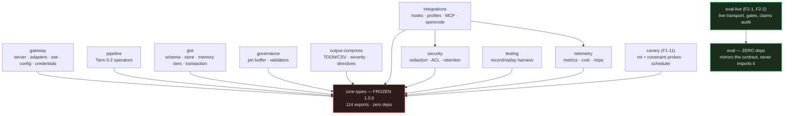
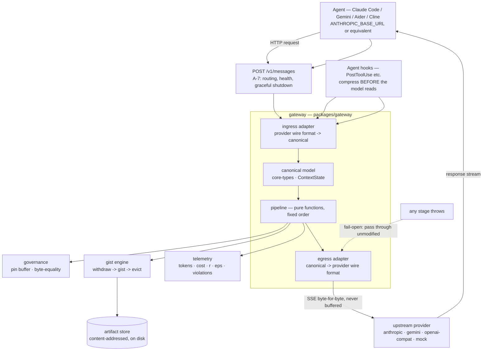
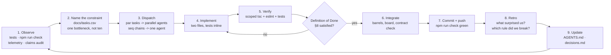

# AGENTS.md — Working Rules for Automated Contributors

> **How to work in this repo.** The product requirements live in `docs/spec.md`, the design in
> `docs/architecture.md`, the plan in `docs/development.md`, and the queue of record in
> `docs/tasks.csv`. This file is the operational contract: the rules an agent follows, the
> invariants it must not break, and the loop that keeps the repo improving. Where this file and
> a `docs/` page disagree about *design*, `docs/` wins and this file is the bug.

**Board state at time of writing:** 79/95 tasks done. Remaining: `A-13` (cache-prefix awareness),
`B-9` (Ollama narration), `J-5`…`J-7` (release, surface-check schedule, dev compose), and
`F1-4`…`F1-11` (corpus + the six eval suites). `B-9`, `F1-4` and `F2-1`…`F2-3` are externally
blocked — see §7 before picking anything up.

---

## 1. Prime Directive

**The contract is frozen.** `packages/core-types@1.0.0` (digest `0a3c0fea6360e6d9`) is immutable. No agent may add, remove, or change its public exports. If you need a new type, propose it in your task report — the contract owner will decide whether to unfreeze.

---

## 2. Project Topology

```
strata-ctx/
├─ packages/
│  ├─ core-types/       # WS-A. Canonical model, policy, pipeline interfaces. ZERO deps.
│  ├─ gateway/          # WS-A. HTTP server, ingress/egress adapters, SSE passthrough
│  ├─ pipeline/         # WS-B. Tiers 0-2 operators (dedupe, truncate, pointer, triage, self-gist)
│  ├─ gist/             # WS-C. Schema, self-gist parsing, store, memory tiers, transaction
│  ├─ governance/       # WS-D. Pin buffer, policy store, validators, byte-equality
│  ├─ output-compress/  # WS-H. TOON/CSV, severity log compression, pointer-ization, directives
│  ├─ telemetry/        # WS-G. Metrics, cost engine, CLI dashboard, pricing
│  ├─ security/         # WS-I. Redaction, entropy, ACL, gist safety, purge, retention
│  ├─ integrations/     # WS-E. Claude Code hooks, Gemini CLI, Aider/Cline/Roo profiles, Copilot MCP, OpenCode, MCP server
│  ├─ eval/             # WS-F1. Fixture format, runner, reporter, mock arms, grading, suites E1/E2/E3/E5/E6
│  ├─ canary/           # WS-F1 (F1-11). Runtime rot + constraint probes, scheduler
│  └─ testing/          # WS-J. Record/replay harness, fixtures, CLI
├─ docs/
│  ├─ architecture.md   # Topology, pipeline order, canonical model
│  ├─ integrations.md   # Three tiers of integration, feasibility matrix, configs
│  ├─ development.md    # Workstreams, parallelism, waves, Definition of Done
│  ├─ spec.md           # Product requirements, non-goals, success criteria
│  ├─ evaluation.md     # Methodology, statistical gates, negative control
│  └─ decisions.md      # Design decision log (R1–Rn)
├─ scripts/
│  └─ check-contract.mjs   # contract:check / contract:update
├─ tools/
│  ├─ dev.ts               # `npm run dev` — gateway + mock upstream
│  └─ mock-upstream.ts
├─ tsconfig.base.json   # Shared strict TypeScript config
├─ tsconfig.json        # Root composite with package references
├─ tsconfig.check.json  # src + test + tools + scripts, for type-aware lint
├─ eslint.config.mjs    # Type-aware; the enforcement point for §3
├─ package.json         # npm workspace root; Node >= 20.11
└─ .github/workflows/
   └─ ci.yml            # 4 lanes: typecheck, tests, contract, selfcheck
```

**Resolved doc drift:** `docs/development.md` §1 named `packages/evals` and listed no
`packages/canary`. Reality as of F1-11: the package is `packages/eval` (singular), and
`packages/canary` **does** now exist (F1-11, the runtime rot + constraint probes). Trust the
filesystem over the table; fix the table in a docs commit, not silently.

`ci.yml` lanes, and what each one proves:

| Lane | Command | Proves |
|---|---|---|
| `typecheck` | `npm run typecheck` | `tsc --build` + `tsc -p tsconfig.check.json` |
| `tests` | `npm run test` | `node scripts/run-tests.mjs` — enumerates suite, fails if empty, pins `--test-reporter=tap`, enforces a deadline, refuses to run under `NODE_TEST_CONTEXT`, and reports failures seen before any hang |
| `contract` | `npm run contract:check` | The `core-types` surface still matches `contract.lock.json` |
| `selfcheck` | mutates `tokens.ts`, expects non-zero | The contract gate **can fail** — a gate that cannot fail is not a gate |

---

## 3. TypeScript Rules (Non-Negotiable)

| Rule | Setting | Why |
|------|---------|-----|
| `strict` | `true` | Baseline |
| `noUncheckedIndexedAccess` | `true` | Prevents `[0]` on possibly-empty arrays |
| `exactOptionalPropertyTypes` | `true` | `undefined` vs missing distinction |
| `noImplicitOverride` | `true` | Catches stale overrides |
| `noFallthroughCasesInSwitch` | `true` | Exhaustiveness |
| `noImplicitReturns` | `true` | All paths return |
| `useUnknownInCatchVariables` | `true` | No `any` in catch |
| `isolatedModules` | `true` | Single-file transpilation |
| `verbatimModuleSyntax` | `true` | ESM import/export discipline |
| `composite` + `incremental` | `true` | Project references work |

**ESLint type-aware rules** (`no-unsafe-*`, `consistent-type-assertions`, `no-explicit-any`) are **error** level on `**/*.ts`. Tests (`**/test/**/*.ts`) and `tools/**` get the `no-unsafe-*` and `no-floating-promises` rules **off** — they may reach past the type system, but production code may not. `no-console` is off only for tests, tools and `scripts/`.

Two rules that carry design weight, not style:

- `consistent-type-assertions` bans `as` on object literals (`objectLiteralTypeAssertions: 'never'`). Type assertions are how you defeat the narrowing in `core-types` `guards.ts`; a considered one is allowed, a reflexive one is a bug.
- `no-explicit-any` is **error** because `any` in a lossy stage silently defeats the unrepresentability guarantee the whole product rests on.

---

## 4. Test Discipline

| Requirement | Detail |
|-------------|--------|
| **Runner** | `node scripts/run-tests.mjs` (custom gate over native `node --test` with `tsx`) |
| **Assertion** | `node:assert/strict` |
| **Parallelism** | Run independent package suites in parallel; `tsc --build` / root `npm run check` are serial |
| **Coverage target** | Every operator: ≥1 negative test (a "should not do this" case) |
| **Determinism test** | Same input ⇒ byte-identical output for Tiers 0–2 |
| **Fail-open test** | Throwing error ⇒ unmodified passthrough |
| **Telemetry emission** | Every stage must emit its events |
| **Unrepresentability test** (WS-D) | Governance blocks cannot reach lossy stages — type-level proof |

**Why the repo owns the test gate (not a flag).** A bare `node --test` over a shell glob has four failure modes the gate explicitly addresses: (1) a leaked handle (unclosed server/socket/timer) keeps the event loop open so the runner never prints `# fail` or exits (output is buffered per file until it drains); (2) zero shell matches produce a silent green run (`# tests 0 / # fail 0`); (3) inheriting `NODE_TEST_CONTEXT` (e.g. nested runner) discovers nothing and exits 0; (4) TAP/spec reporter differs by TTY. The custom gate enumerates the suite itself (fails on empty), pins `--test-reporter=tap`, rejects `NODE_TEST_CONTEXT`, enforces a wall-clock deadline, names failures seen before any hang, and otherwise propagates exit codes. The non-obvious blocker is **version incoherence**: `package.json` `engines.node` promises `>= 20.11` and `ci.yml` pins `20.19`, but upstream's hang fix (`--test-force-exit`) is not present on Node 20.12.1 (`node: bad option`, exit 9). A flag-only fix would be green on one supported version and a hard error on another, so the bound must live in this repo's runner. |

---

## 5. Git & Commit Discipline

| Rule | Detail |
|------|--------|
| **Branch** | `main` only; no long-lived feature branches |
| **Commit style** | Conventional: `feat:`, `fix:`, `refactor:`, `test:`, `docs:`, `chore:` |
| **Subject line** | ≤ 72 chars, imperative mood |
| **Body** | What + why (not how); reference task IDs (`E-2`, `A-14`) |
| **Pre-push** | `npm run check` must pass locally |
| **CI** | GitHub Actions runs the same `npm run check` + contract diff |

---

## 6. Agent Workflow (When You Are Dispatched)

### 6.1 You Own Exactly Two Files (Unless Told Otherwise)

```
packages/<stream>/src/<task>.ts
packages/<stream>/test/<task>.test.ts
```

**Never** edit:
- `packages/core-types/**` (FROZEN)
- Root configs (`tsconfig.json`, `package.json`, `package-lock.json`)
- Other packages' `src/` or `test/`
- `packages/<stream>/src/index.ts` (barrel ownership is separate)
- `docs/tasks.csv` (the board owner updates status)

### 6.2 Fixtures Are Inline

Put test fixtures **inside your test file**. Do not create or modify shared fixture files.

### 6.3 No New Dependencies

The workspace dependencies are fixed. If you genuinely need something new, report it — do not `npm install`.

### 6.4 Verification Commands (Run Before Finishing)

```bash
cd /Users/vinodatwal/Documents/research/strata-ctx
npx tsc -p packages/<your-package>/tsconfig.json --noEmit --composite false --incremental false
npx tsc -p tsconfig.check.json --noEmit     # REQUIRED: the package config excludes test/
npx eslint packages/<your-package>/src/<task>.ts packages/<your-package>/test/<task>.ts
node --import tsx --test packages/<your-package>/test/<task>.test.ts
```

All four **must be clean**. `tsx` transpiles without typechecking, so a test that runs green can
still be a type error — and the second command is the only one that sees it. Report other
packages' errors rather than fixing them; they belong to whoever owns those files.

Do not run `npm run check`, `npm install`, or `tsc --build` (shared state).

### 6.5 Report Template

When you finish, return:
- Files created/modified
- Test count (pass/fail)
- Any core-types additions you needed but did **not** make (proposals only)
- Any cross-cutting concerns you observed

---

## 7. Parallelism Rules (For Agent Swarms)

| Rule | Detail |
|------|--------|
| **P1** | `core-types` is the only shared contract. All streams import from it and nothing else cross-stream. If you need something another package exposes, it goes through `core-types` or it waits. |
| **P2** | Package-local test suites. Cross-stream integration tests live in WS-F's `integration` lane only. |
| **P3** | WS-D (governance) has a separate reviewer and a veto. It can block WS-B/WS-C merges. |
| **Barrels** | `packages/*/src/index.ts` is owned by the integrator, not by task agents. Create your module; the barrel export is added at integration time. |
| **Root config** | `tsconfig.json` references, root `package.json`, lockfiles, `docs/tasks.csv`, and `.github/workflows/**` are integrator-owned. A new package ships its own `package.json` + `tsconfig.json`; the root reference is added at merge time. |

### 7.1 Isolation rules (these exist because they were violated)

Running N agents in one tree fails in three specific, repeatable ways. Each has a rule:

| # | Failure | Rule |
|---|---------|------|
| **I1** | Agent A runs `npm test` or `packages/*/test/*.test.ts`, sees agent B's half-written suite fail, and "fixes" B's file or reports a false failure | **Run only your own test file(s)**, by exact path. Never a glob, never `npm test`, never `npm run check`. A failure in a file you do not own is *not yours* — report it, don't touch it. |
| **I2** | Agent leaves `tmp-*.test.ts`, `scratch-*.ts`, or probe scripts in a `test/` dir; they get picked up by the suite enumeration and break CI permanently | **No scratch files in the repo.** Use `/tmp`. The gate enumerates `packages/*/test/*.test.ts` — anything you leave there ships. |
| **I3** | Agent edits a shared file (`runner.ts`, `types.ts`, a barrel, `docs/tasks.csv`) to unblock itself, creating a merge conflict or a silent behaviour change | **Touch only the files you were given.** If you need a shared file changed, report the required change precisely and let the integrator do it. |

Two more that are not about interference but about wasted work:

- **Don't run serial root commands.** `npm install`, `tsc --build`, `npm run check`, and anything
  git-touching are integrator-only. Five agents each running `tsc --build` serialize against
  each other and each other's build info.
- **A cancelled agent leaves a broken tree, not an empty one.** If you are asked to finish a
  partial file, first run the checks to see the actual damage, repair in place, and expect the
  breakage to be subtler than "file missing". Half-written import lists and a test that *hangs*
  rather than fails are the two that cost the most time.

### 7.2 Merging is the integrator's job, at the end

Agents produce **files**. They do not integrate, and they do not decide that the batch is done.
After every agent in a batch reports:

1. Check for stray scratch files (`git status`) and delete any that exist.
2. Add barrels. Verify export-name collisions mechanically *before* re-exporting — 445 names
   across five concurrently-written suites collided zero times, and that was checked, not hoped.
3. Wire new packages into `tsconfig.json`; confirm a new package's declared dependencies match
   its actual imports exactly.
4. Run the whole-repo checks the agents were forbidden from running: `tsc --build`,
   `tsc -p tsconfig.check.json --noEmit`, `eslint .`, `npm run check`.
5. **Exercise the negative gates.** A green suite that cannot fail is worth nothing. Drive each
   gate to its failing state and confirm it reports the failure. The test gate must be able to
   report its own failure under adverse conditions — including a hang where a leaked handle never
   drains (the runner stops before emitting a verdict). A gate with no `ship anyway` edge reopens
   the task rather than waiving it.
6. Only then update `docs/tasks.csv`, and ask before committing.
| **Task execution hints** | `docs/tasks.csv` column `exec` has exactly four values |

| `exec` | Meaning | Fan-out |
|---|---|---|
| `seq` | Ordered within its stream; has real predecessors | One agent, in order. Do not parallelise. |
| `par` | Independent of its siblings | Safe to hand to separate agents |
| `ext` | Externally blocked (needs a verified agent surface, a downloaded corpus, credentials) | Do not start |
| `agent` | Delegated to a coding agent rather than a human stream | Check the task's own notes |

**`seq` is a real constraint, not a label.** `F1-3` (`exec: seq`, `deps: F1-2`) cannot start
before `F1-2` lands. If you fan out a `seq` chain, give it to *one* agent who works it in
order — that is the parallelism, and splitting it across agents buys nothing but a merge
conflict.

Externally blocked right now, so nobody burns a day rediscovering this:

| Task | Blocked on |
|---|---|
| `B-9` | `exec: ext` — a running Ollama instance to test narration against |
| `F1-4` | Corpus download + licensing clearance for 3 real repos |
| `F2-1`…`F2-3` | Live model-provider credentials + real agent surfaces |

---

## 8. Definition of Done (Every Task)

1. Unit tests in the task's own package, ≥1 negative test per operator (a "should not do this" case). A compression operator with no negative test is a bug factory.
2. Nondeterminism test: same input ⇒ byte-identical output for Tiers 0–2.
3. Emits telemetry per `docs/architecture.md` §8. If a stage can't be measured, it isn't done.
4. Fail-open test: a thrown error results in unmodified passthrough.
5. Citations: any non-obvious constant links to a source or a `TODO(owner)` comment. No folklore.
6. WS-D additionally: a type-level proof that the operation is *unrepresentable* on governance blocks.

---

## 9. Forbidden Patterns

| Pattern | Reason |
|--------|--------|
| `import from '../other-package/src/...'` | Cross-stream coupling; use `core-types` or wait |
| `any` in production code | Defeats the unrepresentability guarantee |
| `eslint-disable` in production code | Hides real issues |
| `npm install` in agent | Dependency drift; report need instead |
| Editing `tsconfig.json` / `package.json` root | Shared state; root owner manages |
| Buffering streaming SSE | Violates N3 (first-token delta unaffected) |
| Logging auth headers | Violates N4/R7. Route every header name through `isSensitiveHeader()`, never a local list |

---

## 10. Key Constants & Their Sources

| Constant | File | Note |
|----------|------|------|
| `TOKEN_PROVIDERS` | `gateway/src/token-estimator.ts` | Char-per-token ratios. Approximate by design; `TODO(WS-A, A-6)` re-fits them from real `usage.input_tokens` |
| `DEFAULT_DEGRADING_ARMS` | `eval/src/mock-arm.ts` | `['control+']` — Control+ is the **negative control**, so it must be able to fail |
| `isSensitiveHeader()` | `gateway/src/credentials.ts` | The API. Backed by the explicit `SENSITIVE_HEADERS` list (6 names) **plus** a module-private `SENSITIVE_PATTERNS` substring list (`api-key`, `api_key`, `token`, `secret`, `cookie`). Use the function; the patterns are not exported and re-deriving them is how a header leaks |
| `SELF_GIST_DIRECTIVE` | **two different exports, not one shared constant** | `pipeline/src/self-gist.ts` exports a `SelfGistMarkers` object (`open`/`close`/`fenceOpen`/`fenceClose`/`instruction`) — the sentinels the *parser* looks for. `integrations/src/templates.ts` exports a *prompt string*. They are not byte-identical and must not be made so. The invariant is narrower and real: the fence and the sentinel must agree, or the parser never fires |
| `FENCE` / `SELF_GIST_LANGUAGE` / `SELF_GIST_SENTINEL` | `integrations/src/templates.ts` | ` ``` `, `ctx-gist`, `<<<STRATA-SELF-GIST>>>`. The E-9 hook guard *rejects* any text containing the sentinel outside a gist block — do not loosen that to "be helpful" |
| `PROVIDERS` | `gateway/src/config.ts` **and** `gateway/src/credentials.ts` | Two different sets that share a name: config = routable upstreams (`anthropic`, `openai-compat`, `gemini`, `mock`); credentials = key-holding providers (`anthropic`, `openai`, `gemini`). `index.ts` re-exports the config one as `CONFIG_PROVIDERS` for exactly this reason. Do not star-export both |
| `contract.lock.json` digest | `packages/core-types/contract.lock.json` | `0a3c0fea6360e6d9`, 114 exports. Change it only via `npm run contract:update`, deliberately |

### Two traps this repo has already paid for

Both were found by verification, not by review, and both are cheap to avoid now that they are written down.

**1. An alias table is part of the public surface.** The MCP server registers short tool
names (`get_task`) and resolves the documented `ctx_`-prefixed spellings through `TOOL_ALIASES`
inside `callTool`. A checker that compared the *advertised* name against the *registered* name
reported all six tools as unserveable — a permanent false advisory on every run, and a gate that
cries wolf is a gate that gets muted. When you write an assertion about a name, ask whether the
lookup goes through a resolver first, and assert against the resolved value. This is the same
class of bug as the `PROVIDERS` pair above: one concept, two spellings, one place that knows.

**2. The package tsconfig excludes `test/`.** `packages/*/tsconfig.json` sets `"include": ["src/**/*.ts"]`,
so a scoped typecheck is structurally blind to test files. A test that passes under `tsx` (which
does not typecheck) can still be a type error, and `npm run check` will be the first thing that
sees it. **Every scoped verification must include `npx tsc -p tsconfig.check.json --noEmit`**, or
it is not verification. Three such errors reached the integrator on the first pass of a
five-agent dispatch.

---

## 11. How to Read the Architecture

Start with:
1. `docs/architecture.md` — topology, pipeline order, canonical model
2. `docs/spec.md` — requirements, non-goals, success criteria
3. `docs/development.md` — workstreams, waves, Definition of Done
4. `docs/integrations.md` — three tiers, feasibility matrix, configs
5. `docs/evaluation.md` — methodology, negative control, statistical gates
6. `docs/decisions.md` — design decision log (R1–Rn)

The **canonical model** (`packages/core-types/src/context.ts`) is the single source of truth for the message format. Everything else is derived.

---

## 12. Deep Map

### 12.1 Package dependency graph (from the real `tsconfig` project references)



Two edges carry the design, and both look like accidents if you don't know why:

- **`integrations → security`, `integrations → telemetry`.** These are the only cross-stream imports in the repo, and they are deliberate. Agent hooks are where untrusted text and credential headers actually arrive, so the hook path must redact and must be measurable. This is the single documented exception to P1; there is no third.
- **`eval-live → eval`, and nothing else.** It holds the live transport, the gate outcomes and the claims audit. The live A/B runner consumes the offline harness's types and reporter so a live run and an offline run produce the same shape — and it lives in a separate package because `eval` has a structural test asserting it opens no sockets. Putting `fetch` behind a subdirectory to dodge that assertion would keep the letter of the rule and break its intent. A live run measures a *prompt prefix*, not a pin: pinning is a gateway property and no single-turn API call demonstrates it.
- **`eval` depends on nothing.** It has no project reference, no dependencies, and a test (`packages/eval/test/runner.test.ts`) asserting the package opens no sockets. It *mirrors* `ConstraintKind` in `types.ts` with a comment recording the freeze digest, rather than importing it — the measuring apparatus must not be able to drift with the thing it measures. If you "clean up" that duplication into a real import, you have broken the experiment.

**`canary` vs `eval` — both measure, and they are not interchangeable.** `eval` is the
offline harness: it measures suites, it must be able to run on every commit, so it is
dependency-free and its subjects are *injected*. `canary` is the runtime product feature: it
fires probes inside a live session, so it depends on `core-types` and its probe subjects are
also injected (F2 drives them against a real model). Both keep the injected-subject shape for
the same reason — a probe that imports the thing it grades cannot be used to detect that
thing failing. Two `TODO(contract owner)` items in `packages/canary` ask for
`RotCanaryEvent` and `DECAY_EXPOSED_STRATA` to move into frozen `core-types`; that is a
contract change and needs the frozen-contract process, not a drive-by edit.

### 12.2 The request path, and where fail-open lives



The stage order is **not** a style preference. `docs/architecture.md` §4 justifies it pair by
pair; the two that bite hardest are `2 truncate` before `5 compact` (never spend a lossy stage on
a block you could have deleted for free) and `4 pin` *after* triage and *around* compaction (the
reason governance cannot be summarized away). Reordering the pipeline is a security change, not a
refactor — it needs a second reviewer per P3.

Streaming responses are piped, never buffered, because the first token is emitted before there is
anything to transform. Anything that accumulates a response body to transform it later violates
N3 and is a correctness bug regardless of tests.

---

## 13. Recursive Improvement

The loop that makes this codebase get better instead of merely staying green. Each turn's
*evidence* is the next turn's *input*; the output of the loop is a smaller uncertainty, not more code.



The three steps that make it recursive rather than a treadmill:

1. **Verify before believing.** An agent reporting "done" is a hypothesis. Step 5 exists because
   a dispatched agent that is wrong is more expensive than one that never started. Root
   `npm run check` is serial and belongs to the integrator, after merges — never to a parallel agent.
2. **Retro is a deliverable, not a mood.** If a task surprised us, that surprise is a missing rule
   in §3/§9/§10, and it gets written down in the same commit. This file is the output of that step;
   a stale `AGENTS.md` is a broken loop, which is why it is versioned with the code.
3. **The board is the bottleneck detector.** `docs/tasks.csv` is the only place work is queued. If
   a task is not on it, it is not scheduled, no matter how obviously necessary it looks.

The loop has a deliberate brake: the `gate` node has no "ship anyway" edge. A task that cannot
pass §8 gets reopened, not waived, and the only legitimate escape is the pre-agreed scope-cut
ladder in `docs/development.md` — decided in advance, in order, so cutting is not a negotiation
under deadline.

---

## 14. Emergency Stop

If you encounter:
- A test that cannot pass without `any` or `eslint-disable` in production code
- A cross-stream dependency that cannot be resolved through `core-types` (the §12.1
  `integrations → security/telemetry` exception is the *only* one; ask before adding a second)
- A governance block that reaches a lossy stage (type error or property test failure)
- A need to reorder the pipeline stages in §12.2

**Stop. Report the blocker. Do not work around it.**

---

*This document is versioned with the code. If you change a rule, update this file in the same commit.*